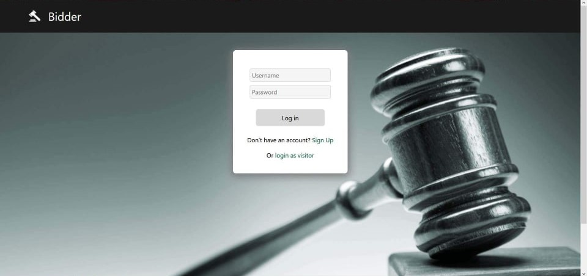
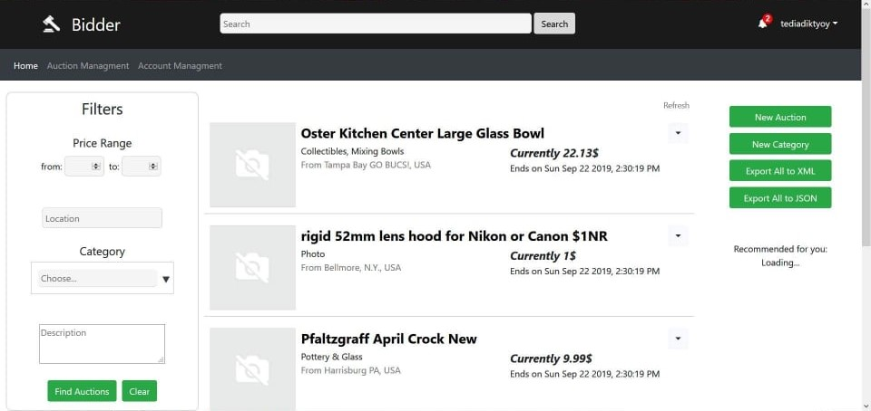
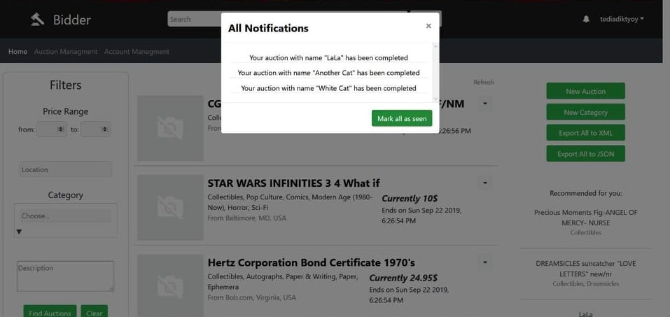
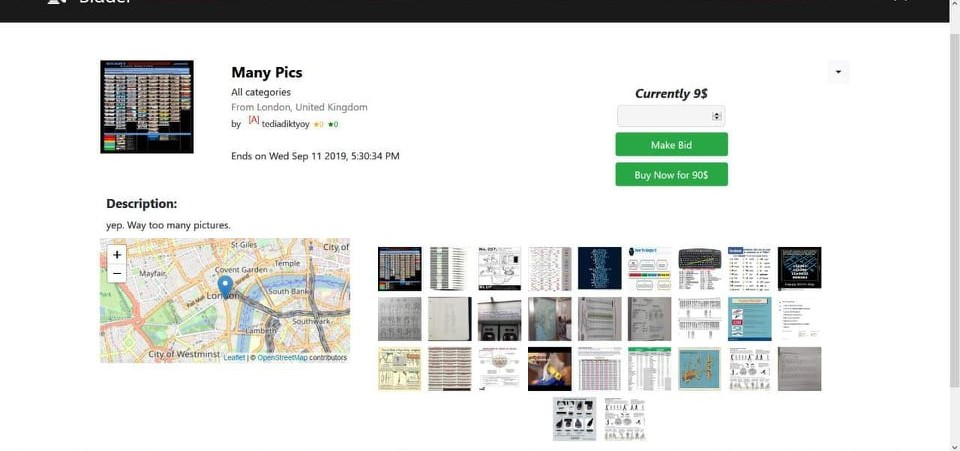
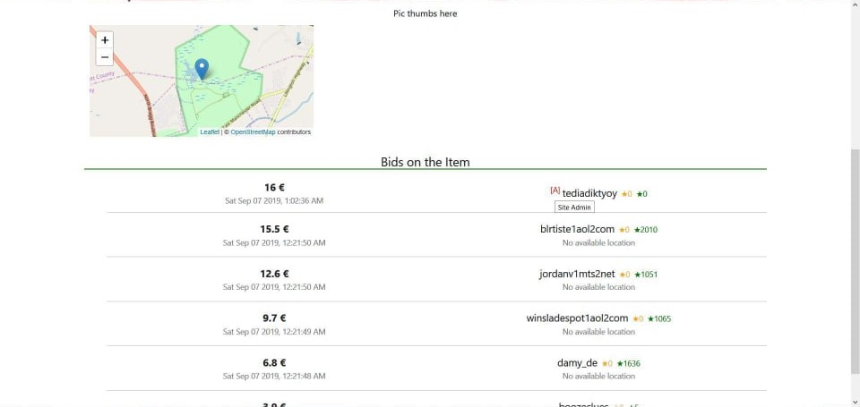
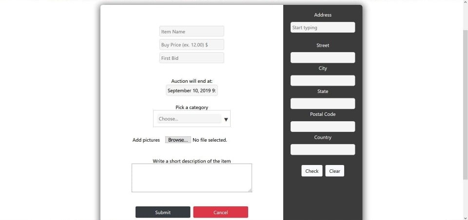
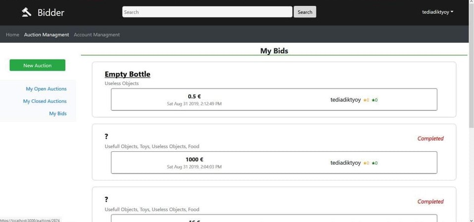
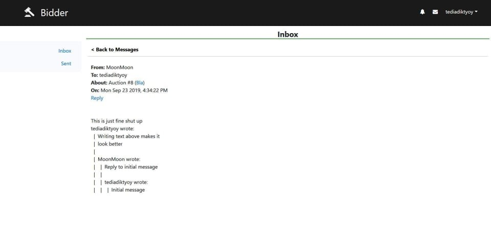
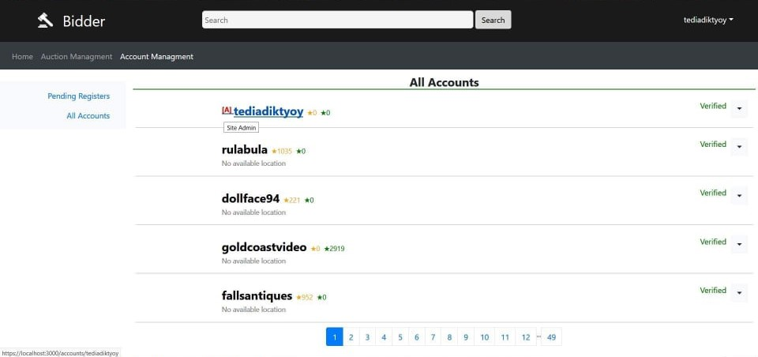

## Τεχνολογίες Εφαρμογών Διαδικτύου, 2019

### Σκοπός

Σκοπός είναι η ανάπτυξη εφαρμογής **ηλεκτρονικών δημοπρασιών (bidding platform)**. Η εφαρμογή αυτή θα υλοποιηθεί βάσει της αρχιτεκτονικής web browser / web server και κάθε χρήστης θα έχει πρόσβαση σε αυτήν μέσω του φυλλομετρητή παγκόσμιου ιστού.

### Ομάδα
- Maria Karamina
- Georgios Koursiounis

### Front-end
React.js (Windows 10)

### Παραδοχές & User stories
1. Αρχικά στον φυλλομετρητή στέλνεται σελίδα login και μέσω σύνδεσης ο χρήστης ανακατευθύνεται στο HomePage

2. Ο επισκέπτης μπορεί να μεταβεί στο HomePage χωρίς σύνδεση μέσω κατάλληλου κουμπιού

3. Το login token αποθηκεύεται στο sessionStorage και έτσι ο χρήστης παραμένει συνδεδεμένος μόνο για τη διάρκεια του session

4. Ένας χρηστής που δεν έχει ακόμα εγκριθεί από τον διαχειριστή έχει τα ίδια δικαιώματα με έναν επισκέπτη.
Μόλις γίνει η έγκριση λαμβάνει ανάλογη ειδοποίηση από την οποία ανανεώνονται τα στοιχεία που είναι αποθηκευμένα στο session

5. Στην αρχική σελίδα ο χρήστης μπορεί να περιηγηθεί στις δημοπρασίες μέσω των φίλτρων ή της μπάρας
αναζήτησης. Στο δεξί μέρος της οθόνης εμφανίζονται στον χρήστη προτεινόμενες δημοπρασίες (bonus)

6. Τα αποτελέσματα από τα φίλτρα και την αναζήτηση έχουν δικό τους url ώστε να μπορεί να τα στείλει σε
κάποιον ή να επιστρέψει σε αυτά από επόμενη σελίδα

7. Πατώντας πάνω σε μια δημοπρασία ο χρήστης μεταβαίνει στη σελίδα της δημοπρασίας (/auctions/{itemId}) όπου
μπορεί να υποβάλλει προσφορές

8. Από την σελίδα της δημοπρασίας καθώς και από το preview της δημοπρασίας στην αρχική οθόνη ο χρήστης
μπορεί να διαγράψει ή να μεταβάλλει τις πληροφορίες της δημοπρασίας (εφόσον του ανήκει)

9. Στη σελίδα διαχείρισης δημοπρασιών (auction managment) ο χρήστης μπορεί να δει τις ανοιχτές/κλειστές του
δημοπρασίες, τις προσφορές του σε δημοπρασίες άλλων καθώς και τις δημοπρασίες 
που έχει επισκεφτεί

10. Ο διαχειριστής έχει πρόσβαση σε ό,τι και ο κοινός χρήστης καθώς και στη σελίδα διαχείρισης χρηστών
(/auction-managment), όπου μπορεί να δει τις αιτήσεις χρηστών όπου εκκρεμεί έγκριση και όλους τους
λογαρισμούς χρηστών. Επιπλέον ο διαχειριστής μπορεί να προσθέσει κατηγορίες (/createCategory) και να εξάγει
τις δημοπρασίες σε .xml και .json (όλες μαζί ή χωριστά)
11. Κάθε 5 δευτερόλεπτα γίνεται έλεγχος για νέα μηνύματα και ειδοποιήσεις και ο χρήστης ειδοποιείται
κατάλληλα μέσω εικονιδίων στο header

12. Θεωρείται πως υπάρχουν νέα μηνύματα όταν ο χρήστης δεν έχει διαβάσει το τελευταίο (σε ημερομηνία)
μήνυμα. Τα υπόλοιπα θεωρούνται αγνοημένα και άρα όχι καινούρια

13. Από το εικονίδιο μηνυμάτων, ο χρήστης μπορεί να μεταβεί στη σελίδα μηνυμάτων όπου μπορεί να δει τα
εισερχόμενα μηνύματα (/messages/inbox) καθώς και τα απεσταλμένα μηνύματα. Ο χρήστης μπορεί να διαγράψει ή να
απαντήσει σε ένα μήνυμα.

14. Μόλις τελειώσει μια δημοπρασία ο πωλητής και ο αγοραστής λαμβάνουν ανάλογη ειδοποίηση από όπου μπορούν
να μεταβούν στη σελίδα της δημοπρασίας και να την αξιολογήσουν ή να στείλουν μήνυμα στον πωλητή/αγοραστή

15. Στις σελίδες των δημοπρασιών (/auctions/{itemId}) καθώς και στη σελίδα εισερχόμενων μηνυμάτων
(/messages/inbox) το περιεχόμενο ανανεώνεται κάθε 5 δευτερόλεπτα για να μένει ενημερωμένο με τα στοιχεία
της βάσης

16. Μέσω του κουμπιού με το όνομα χρήστη στο header, ο χρήστης έχει τη δηνατότητα να αλλάξει τον κωδικό του
ή να αποσυνδεθεί από την εφαρμογή

### Εγκατάσταση

1. Download Node.js (https://nodejs.org/en/)
2. cd TED_frontend
3. npm install

### Εκκίνηση

- npm start μέσα από τον φάκελο TED_frontend
- Στον φυλλομετρητή: https://localhost:3000

### Screenshots

---

---

---

---

---

---

---

---

 
